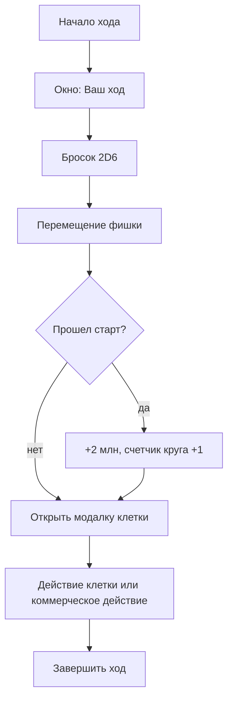

# PROLEUM Monopoly: последовательности действий

## Бросок и клетка

## Взять контракт

Условия:

- игрок уже бросил кубики;
- игрок стоит на `contract` или `client`;
- коммерческое действие еще не использовано;
- у игрока меньше лимита активных контрактов из настроек баланса;
- выполнены требования карточки к репутации, эффективности или влиянию.

Результат:

- создается экземпляр контракта в `activeContracts`;
- заполняются `filled` нулями;
- коммерческое действие помечается использованным.

## Купить ресурс

Условия:

- игрок стоит на `supplier` или `market`;
- коммерческое действие не использовано;
- на рынке есть остаток;
- на складе есть место;
- хватает денег.

Результат:

- деньги списываются;
- ресурс добавляется на склад;
- остаток рынка уменьшается;
- коммерческое действие помечается использованным.

## Обеспечить контракт

Условия:

- контракт активен у игрока;
- контракт еще не полностью обеспечен;
- коммерческое действие свободно;
- хватает денег на докупку и срочный ресурс.

Алгоритм:

1. Посчитать недостающие ресурсы.
2. Списать доступное со склада.
3. Купить с рынка в пределах лимита.
4. Остаток купить срочно у банка по цене `база + 2`.
5. Увеличить `contract.filled`.
6. Списать деньги и остатки рынка.
7. Если применялся hedge, списать использованный hedge из руки.
8. Показать отдельный итог обеспечения: сколько взято со склада, куплено на рынке, приобретено срочно и сколько денег списано.

Обеспечение не закрывает контракт автоматически. После него карточка остается в `activeContracts`, а игрок отдельно выбирает маршрут поставки.

## Закрыть поставку

Условия:

- контракт полностью обеспечен;
- коммерческое действие свободно;
- выбран доступный маршрут;
- хватает денег на логистику;
- есть мощность ЖД/нефтебазы, если маршрут требует.

Алгоритм:

1. Игрок выбирает маршрут в модальном окне.
2. Списывается стоимость логистики.
3. Списывается мощность дня.
4. Выполняется риск-проверка.
5. Выплачивается доход контракта с учетом активной карты рынка.
6. Начисляются репутация/эффективность/влияние.
7. Контракт переносится в `completedContracts`.
8. Показывается итог поставки: доход, логистика, рыночная корректировка, бонус актива и результат риск-проверки.

## Переговорная сделка

Условия:

- кубики уже брошены;
- в комнате есть другой игрок;
- переговорная сделка в этот ход еще не использована;
- на складе продавца есть выбранный ресурс.

Алгоритм:

1. Продавец выбирает покупателя, один жетон ресурса и цену.
2. Предложение сохраняется со статусом `pending`.
3. Покупатель принимает или отклоняет предложение.
4. При принятии повторно проверяются ресурс, деньги и складская вместимость.
5. Ресурс и деньги передаются одной операцией, предложение получает статус `accepted`.

## Завершение партии

После последнего полного круга последнего торгового дня:

1. комната получает статус `finished`;
2. рассчитывается и сохраняется итоговый рейтинг;
3. открывается экран результатов;
4. игровые действия становятся недоступны;
5. повторное открытие или обновление страницы сохраняет результаты.

## Купить актив

Условия:

- игрок стоит на клетке актива;
- действие клетки свободно;
- актив клетки еще не куплен;
- за этот круг игрок еще не покупал актив;
- хватает денег.

Результат:

- актив добавляется игроку;
- запись появляется в `assetOwnership[cellId]`;
- действие клетки помечается использованным.

## Событие

Клетки `event`, `risk`, `penalty`, `pause` открывают событие из баланса с собственными вариантами выбора:

- заплатить указанную сумму;
- потерять репутацию или влияние;
- применить hedge;
- получить позитивный эффект;
- принять задержку по первому активному контракту.

## Карта рынка

Условия:

- игрок стоит на `marketCard`;
- действие клетки свободно.

Результат:

- индекс карты рынка увеличивается;
- рынок дня пересчитывается: цены, остатки ресурсов и доступная логистика;
- действие клетки помечается использованным.

## Hedge MOEX

Условия:

- игрок стоит на `hedge`;
- коммерческое действие свободно;
- в руке меньше 2 hedge;
- хватает 1 млн.

Результат:

- в `hedgeTokens` добавляется токен ресурса клетки;
- при будущем обеспечении контракта до 2 жетонов этого ресурса считаются по базовой цене, а не по рыночной.

## Брокерский контур

Условия:

- игрок стоит на `broker`;
- коммерческое действие свободно;
- есть активный контракт;
- хватает денег на брокерскую комиссию.

Результат:

- контракт снимается с активных;
- игрок получает +1 влияние;
- контракт попадает в `brokeredContracts`;
- в победных очках считается как 1 VP.
