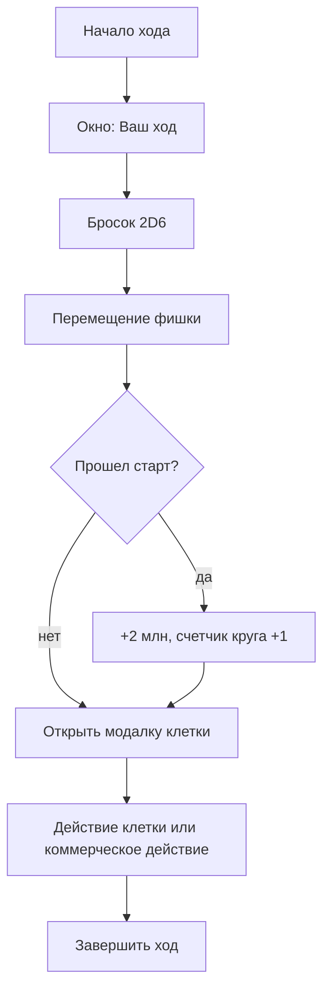

# PROLEUM Monopoly: последовательности действий

## Бросок и клетка

## Взять контракт

Условия:

- игрок уже бросил кубики;
- игрок стоит на `contract` или `client`;
- коммерческое действие еще не использовано;
- у игрока меньше 3 активных контрактов.

Результат:

- создается экземпляр контракта в `activeContracts`;
- заполняются `filled` нулями;
- коммерческое действие помечается использованным.

## Купить ресурс

Условия:

- игрок стоит на `supplier` или `market`;
- коммерческое действие не использовано;
- на рынке есть остаток;
- на складе есть место;
- хватает денег.

Результат:

- деньги списываются;
- ресурс добавляется на склад;
- остаток рынка уменьшается;
- коммерческое действие помечается использованным.

## Обеспечить контракт

Условия:

- контракт активен у игрока;
- контракт еще не полностью обеспечен;
- коммерческое действие свободно;
- хватает денег на докупку и срочный ресурс.

Алгоритм:

1. Посчитать недостающие ресурсы.
2. Списать доступное со склада.
3. Купить с рынка в пределах лимита.
4. Остаток купить срочно у банка по цене `база + 2`.
5. Увеличить `contract.filled`.
6. Списать деньги и остатки рынка.

## Закрыть поставку

Условия:

- контракт полностью обеспечен;
- коммерческое действие свободно;
- выбран доступный маршрут;
- хватает денег на логистику;
- есть мощность ЖД/нефтебазы, если маршрут требует.

Алгоритм:

1. Игрок выбирает маршрут в модальном окне.
2. Списывается стоимость логистики.
3. Списывается мощность дня.
4. Выполняется риск-проверка.
5. Выплачивается доход контракта.
6. Начисляются репутация/эффективность/влияние.
7. Контракт переносится в `completedContracts`.

## Купить актив

Условия:

- игрок стоит на клетке актива;
- действие клетки свободно;
- актив клетки еще не куплен;
- за этот круг игрок еще не покупал актив;
- хватает денег.

Результат:

- актив добавляется игроку;
- запись появляется в `assetOwnership[cellId]`;
- действие клетки помечается использованным.

## Событие

Клетки `event`, `risk`, `penalty`, `pause` открывают событие с выбором:

- заплатить 2 млн и сохранить темп;
- потерять 1 репутацию;
- принять задержку по первому активному контракту.

Позже этот блок нужно расширить: каждая карточка события должна хранить собственные варианты выбора, условия и эффекты.

